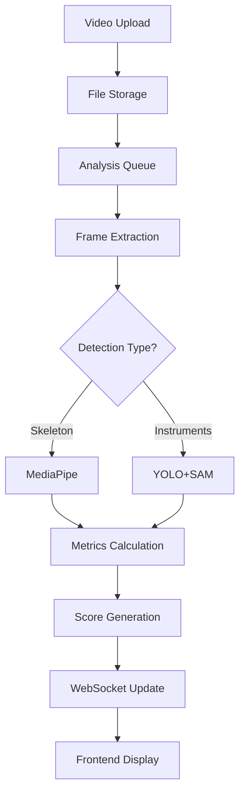

# アーキテクチャ設計書 - AI Surgical Motion Knowledge Transfer Library

## 目次
1. [システム概要](#システム概要)
2. [設計原則](#設計原則)
3. [アーキテクチャパターン](#アーキテクチャパターン)
4. [レイヤー構成](#レイヤー構成)
5. [コンポーネント設計](#コンポーネント設計)
6. [データフロー](#データフロー)
7. [非機能要件](#非機能要件)
8. [技術スタック](#技術スタック)

## システム概要

### ミッション
手術動作の分析と評価を通じて、医療従事者のスキル向上を支援するAIプラットフォーム

### 主要機能
- 手術ビデオのアップロードと管理
- AI による動作検出と追跡（MediaPipe、YOLOv8、SAM）
- リアルタイムのモーションメトリクス計算
- リファレンス動画との比較分析
- スコアリングとフィードバック生成

## 設計原則

### 1. レイヤードアーキテクチャ + Domain-Driven Design
```
理由: ビジネスロジックの保護と保守性の向上
```

### 2. 非同期処理とイベント駆動
```
理由: 重いAI処理を効率的に管理
```

### 3. マイクロサービス指向
```
理由: AI処理とビジネスロジックの分離
```

## アーキテクチャパターン

### Clean Architecture の採用
```
┌────────────────────────────────────┐
│         Presentation Layer         │  ← Next.js Frontend
├────────────────────────────────────┤
│         Application Layer          │  ← FastAPI Routes
├────────────────────────────────────┤
│           Domain Layer             │  ← Business Logic
├────────────────────────────────────┤
│        Infrastructure Layer        │  ← DB, AI Engines
└────────────────────────────────────┘
```

## レイヤー構成

### Frontend (Presentation Layer)
**責務**: ユーザーインターフェースとユーザー体験
**場所**: `frontend/`
```typescript
// コンポーネントの責任範囲
- UI表示ロジック
- ユーザーイベントのハンドリング
- APIとの通信
- 状態管理（Zustand）

// 禁止事項
- ビジネスロジックの実装
- 直接的なデータベースアクセス
```

### Backend - Application Layer
**責務**: APIエンドポイントとリクエスト処理
**場所**: `backend/app/api/`
```python
# このレイヤーの責任
- リクエスト/レスポンスの変換
- 認証・認可
- 入力検証
- サービスレイヤーの呼び出し

# 禁止事項
- 複雑なビジネスロジック
- 直接的なデータベース操作
```

### Backend - Domain Layer
**責務**: ビジネスロジックとドメインモデル
**場所**: `backend/app/services/`, `backend/app/models/`
```python
# このレイヤーの責任
- ビジネスルールの実装
- エンティティとバリューオブジェクト
- ドメインイベント
- ユースケースの実装

# 禁止事項
- フレームワーク依存のコード
- インフラストラクチャの詳細
```

### Backend - Infrastructure Layer
**責務**: 外部システムとの統合
**場所**: `backend/app/db/`, `backend/app/ai_engine/`
```python
# このレイヤーの責任
- データベースアクセス（SQLAlchemy）
- AI処理エンジン（MediaPipe、YOLOv8）
- ファイルシステム操作
- 外部API連携

# 禁止事項
- ビジネスロジックの混入
```

## コンポーネント設計

### 主要サービス
```yaml
AnalysisService:
  責務: "分析パイプラインの管理"
  依存: ["VideoProcessor", "AIEngine", "MetricsCalculator"]

ScoringService:
  責務: "スコアリングロジック"
  依存: ["AnalysisService", "ComparisonEngine"]

InstrumentTrackingService:
  責務: "手術器具の検出と追跡"
  依存: ["YOLODetector", "SAMTracker"]

WebSocketManager:
  責務: "リアルタイム通信"
  依存: ["EventBus"]
```

### AIエンジンアーキテクチャ
```yaml
MediaPipeProcessor:
  用途: "手・体の骨格検出"
  入力: "ビデオフレーム"
  出力: "ランドマーク座標"

YOLOv8Detector:
  用途: "手術器具検出"
  入力: "ビデオフレーム"
  出力: "バウンディングボックス"

SAMTracker:
  用途: "セグメンテーション追跡"
  入力: "フレーム + バウンディングボックス"
  出力: "セグメンテーションマスク"
```

## データフロー

### 動画アップロードから分析完了まで


### リアルタイム進捗更新
```python
# WebSocketフロー
1. Analysis Start → Send "started" event
2. Frame Processing → Send "progress" event (0-100%)
3. Detection Complete → Send "detection_complete" event
4. Scoring Complete → Send "completed" event with results
```

## 非機能要件

### パフォーマンス要件
```yaml
ファイルアップロード:
  最大サイズ: "2GB"
  並行処理: "3ファイル"

動画処理:
  フレームレート: "30fps"
  解像度: "1920x1080"
  処理時間: "動画長の2倍以内"

レスポンス時間:
  API: "< 200ms (95パーセンタイル)"
  WebSocket: "< 50ms"
```

### スケーラビリティ
```yaml
水平スケーリング:
  - APIサーバー: "ロードバランサー対応"
  - AI処理: "ワーカープール（Celery検討）"

垂直スケーリング:
  - GPU利用: "CUDA対応"
  - メモリ最適化: "ストリーム処理"
```

### セキュリティ
```yaml
認証:
  現在: "なし（プロトタイプ）"
  将来: "JWT + OAuth2.0"

データ保護:
  - HTTPS通信
  - ファイルアクセス制限
  - SQL Injection対策（SQLAlchemy）
```

## 技術スタック

### Frontend
```yaml
Framework: "Next.js 15.5.2"
言語: "TypeScript"
状態管理: "Zustand v5.0.8"
スタイリング: "Tailwind CSS v4"
チャート: "Chart.js v4.5.0, Recharts v3.2.1"
3Dレンダリング: "Three.js + @react-three/fiber"
テスト: "Playwright v1.55.0"
```

### Backend
```yaml
Framework: "FastAPI"
言語: "Python 3.11.9"
ORM: "SQLAlchemy"
データベース: "SQLite (開発), PostgreSQL (本番推奨)"
AI/ML:
  - "MediaPipe >= 0.10.0"
  - "Ultralytics YOLOv8 == 8.0.200"
  - "Segment Anything Model (SAM)"
WebSocket: "FastAPI WebSocket"
```

## 開発ガイドライン

### コード配置の原則
1. **ビジネスロジック** → `backend/app/services/`
2. **データベースアクセス** → `backend/app/db/`
3. **AI処理** → `backend/app/ai_engine/`
4. **APIエンドポイント** → `backend/app/api/routes/`
5. **UIコンポーネント** → `frontend/components/`
6. **ページ** → `frontend/app/`

### 新機能追加時のチェックリスト
- [ ] 適切なレイヤーに配置されているか
- [ ] 責任範囲が明確か
- [ ] 依存関係が適切か
- [ ] テストが書かれているか
- [ ] ドキュメントが更新されているか

## 今後の拡張計画

### Phase 1 (現在)
- 基本的な動画分析機能
- スコアリング機能
- 比較分析

### Phase 2
- 認証・認可システム
- マルチユーザー対応
- クラウドストレージ統合

### Phase 3
- リアルタイム分析（ライブストリーミング）
- 機械学習モデルのカスタマイズ
- 高度な分析レポート生成

---
*最終更新: 2024年9月27日*
*このドキュメントはClaude Codeとの協働開発を前提に作成されています*