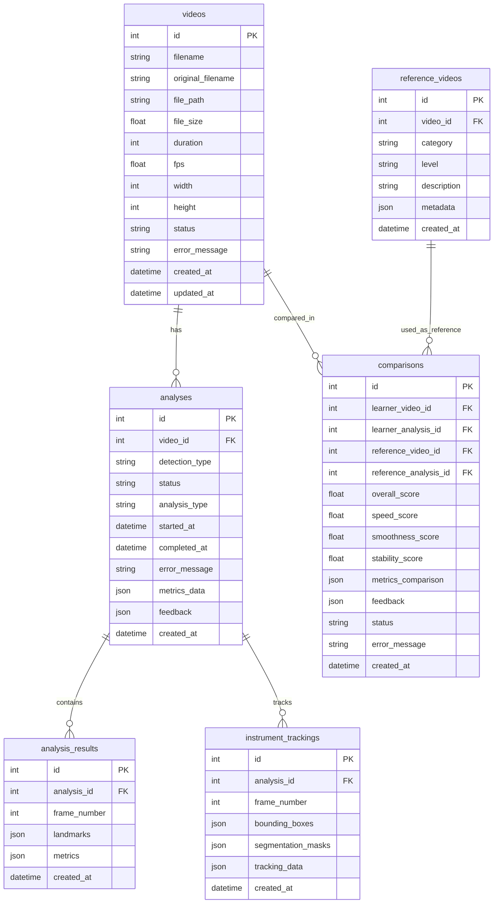

# データベース設計書 - AI Surgical Motion Knowledge Transfer Library

## 目次
1. [概要](#概要)
2. [命名規則](#命名規則)
3. [ER図](#er図)
4. [テーブル定義](#テーブル定義)
5. [インデックス設計](#インデックス設計)
6. [リレーション設計](#リレーション設計)
7. [データ型の選択](#データ型の選択)
8. [マイグレーション方針](#マイグレーション方針)

## 概要

### データベース選択
- **開発環境**: SQLite
- **本番環境推奨**: PostgreSQL
- **ORM**: SQLAlchemy

### 設計方針
- 正規化を基本とし、パフォーマンスが必要な箇所のみ非正規化
- 削除はソフトデリート（deleted_at）を基本とする
- 全テーブルにタイムスタンプ（created_at, updated_at）を付与

## 命名規則

### テーブル名
- 複数形のsnake_case: `videos`, `analyses`, `reference_videos`

### カラム名
- snake_case: `video_id`, `created_at`, `total_frames`
- 外部キーは `_id` サフィックス: `video_id`, `analysis_id`
- Boolean型は `is_` または `has_` プレフィックス: `is_reference`, `has_audio`

### インデックス名
- `idx_[table]_[column(s)]`: `idx_analyses_video_id`, `idx_videos_created_at`

## ER図



## テーブル定義

### videos テーブル
**用途**: アップロードされた動画ファイルの管理

| カラム名 | データ型 | NULL | デフォルト | 説明 |
|---------|---------|------|------------|------|
| id | INTEGER | NO | AUTO_INCREMENT | 主キー |
| filename | VARCHAR(255) | NO | | システム内でのファイル名 |
| original_filename | VARCHAR(255) | NO | | ユーザーがアップロードした際の元ファイル名 |
| file_path | VARCHAR(500) | NO | | ファイルシステム上のパス |
| file_size | FLOAT | YES | | ファイルサイズ（バイト） |
| duration | INTEGER | YES | | 動画の長さ（秒） |
| fps | FLOAT | YES | | フレームレート |
| width | INTEGER | YES | | 動画の幅（ピクセル） |
| height | INTEGER | YES | | 動画の高さ（ピクセル） |
| status | VARCHAR(50) | NO | 'pending' | 状態（pending/processing/completed/failed） |
| error_message | TEXT | YES | | エラー発生時のメッセージ |
| created_at | TIMESTAMP | NO | CURRENT_TIMESTAMP | 作成日時 |
| updated_at | TIMESTAMP | NO | CURRENT_TIMESTAMP | 更新日時 |

### analyses テーブル
**用途**: 動画分析セッションの管理

| カラム名 | データ型 | NULL | デフォルト | 説明 |
|---------|---------|------|------------|------|
| id | INTEGER | NO | AUTO_INCREMENT | 主キー |
| video_id | INTEGER | NO | | 分析対象動画ID（FK） |
| detection_type | VARCHAR(50) | NO | | 検出タイプ（external/internal/hybrid） |
| status | VARCHAR(50) | NO | 'pending' | 状態 |
| analysis_type | VARCHAR(50) | YES | | 分析タイプ |
| started_at | TIMESTAMP | YES | | 分析開始時刻 |
| completed_at | TIMESTAMP | YES | | 分析完了時刻 |
| error_message | TEXT | YES | | エラーメッセージ |
| metrics_data | JSON | YES | | メトリクスデータ |
| feedback | JSON | YES | | AIフィードバック |
| created_at | TIMESTAMP | NO | CURRENT_TIMESTAMP | 作成日時 |

### reference_videos テーブル
**用途**: リファレンス（お手本）動画の管理

| カラム名 | データ型 | NULL | デフォルト | 説明 |
|---------|---------|------|------------|------|
| id | INTEGER | NO | AUTO_INCREMENT | 主キー |
| video_id | INTEGER | NO | | 動画ID（FK） |
| category | VARCHAR(100) | YES | | カテゴリ（手術タイプなど） |
| level | VARCHAR(50) | YES | | レベル（beginner/intermediate/expert） |
| description | TEXT | YES | | 説明 |
| metadata | JSON | YES | | メタデータ |
| created_at | TIMESTAMP | NO | CURRENT_TIMESTAMP | 作成日時 |

### comparisons テーブル
**用途**: 学習者とリファレンスの比較結果

| カラム名 | データ型 | NULL | デフォルト | 説明 |
|---------|---------|------|------------|------|
| id | INTEGER | NO | AUTO_INCREMENT | 主キー |
| learner_video_id | INTEGER | NO | | 学習者動画ID（FK） |
| learner_analysis_id | INTEGER | NO | | 学習者分析ID（FK） |
| reference_video_id | INTEGER | NO | | リファレンス動画ID（FK） |
| reference_analysis_id | INTEGER | NO | | リファレンス分析ID（FK） |
| overall_score | FLOAT | YES | | 総合スコア（0-100） |
| speed_score | FLOAT | YES | | 速度スコア |
| smoothness_score | FLOAT | YES | | 滑らかさスコア |
| stability_score | FLOAT | YES | | 安定性スコア |
| metrics_comparison | JSON | YES | | 詳細比較データ |
| feedback | JSON | YES | | フィードバック |
| status | VARCHAR(50) | NO | 'pending' | 状態 |
| error_message | TEXT | YES | | エラーメッセージ |
| created_at | TIMESTAMP | NO | CURRENT_TIMESTAMP | 作成日時 |

### analysis_results テーブル
**用途**: フレームごとの分析結果

| カラム名 | データ型 | NULL | デフォルト | 説明 |
|---------|---------|------|------------|------|
| id | INTEGER | NO | AUTO_INCREMENT | 主キー |
| analysis_id | INTEGER | NO | | 分析ID（FK） |
| frame_number | INTEGER | NO | | フレーム番号 |
| landmarks | JSON | YES | | ランドマーク座標 |
| metrics | JSON | YES | | フレームメトリクス |
| created_at | TIMESTAMP | NO | CURRENT_TIMESTAMP | 作成日時 |

### instrument_trackings テーブル
**用途**: 器具追跡データ

| カラム名 | データ型 | NULL | デフォルト | 説明 |
|---------|---------|------|------------|------|
| id | INTEGER | NO | AUTO_INCREMENT | 主キー |
| analysis_id | INTEGER | NO | | 分析ID（FK） |
| frame_number | INTEGER | NO | | フレーム番号 |
| bounding_boxes | JSON | YES | | バウンディングボックス |
| segmentation_masks | JSON | YES | | セグメンテーションマスク |
| tracking_data | JSON | YES | | 追跡データ |
| created_at | TIMESTAMP | NO | CURRENT_TIMESTAMP | 作成日時 |

## インデックス設計

### パフォーマンス向上のためのインデックス

```sql
-- 頻繁にJOINされる外部キー
CREATE INDEX idx_analyses_video_id ON analyses(video_id);
CREATE INDEX idx_comparisons_learner_video_id ON comparisons(learner_video_id);
CREATE INDEX idx_comparisons_reference_video_id ON comparisons(reference_video_id);
CREATE INDEX idx_analysis_results_analysis_id ON analysis_results(analysis_id);
CREATE INDEX idx_instrument_trackings_analysis_id ON instrument_trackings(analysis_id);

-- ステータスベースの検索
CREATE INDEX idx_videos_status ON videos(status);
CREATE INDEX idx_analyses_status ON analyses(status);
CREATE INDEX idx_comparisons_status ON comparisons(status);

-- 時系列検索
CREATE INDEX idx_videos_created_at ON videos(created_at DESC);
CREATE INDEX idx_analyses_created_at ON analyses(created_at DESC);
CREATE INDEX idx_comparisons_created_at ON comparisons(created_at DESC);

-- 複合インデックス
CREATE INDEX idx_analyses_video_status ON analyses(video_id, status);
CREATE INDEX idx_analysis_results_analysis_frame ON analysis_results(analysis_id, frame_number);
```

## リレーション設計

### 外部キー制約
```sql
-- analyses -> videos
ALTER TABLE analyses
ADD CONSTRAINT fk_analyses_video
FOREIGN KEY (video_id) REFERENCES videos(id) ON DELETE CASCADE;

-- comparisons -> videos
ALTER TABLE comparisons
ADD CONSTRAINT fk_comparisons_learner_video
FOREIGN KEY (learner_video_id) REFERENCES videos(id) ON DELETE CASCADE;

-- reference_videos -> videos
ALTER TABLE reference_videos
ADD CONSTRAINT fk_reference_videos_video
FOREIGN KEY (video_id) REFERENCES videos(id) ON DELETE CASCADE;

-- analysis_results -> analyses
ALTER TABLE analysis_results
ADD CONSTRAINT fk_analysis_results_analysis
FOREIGN KEY (analysis_id) REFERENCES analyses(id) ON DELETE CASCADE;
```

### カスケード削除ポリシー
- 動画削除時：関連する分析、比較、結果も削除
- 分析削除時：関連する結果データも削除
- ソフトデリート推奨（deleted_atカラムを追加）

## データ型の選択

### JSON型の使用場面
```yaml
metrics_data:
  用途: "動的な分析メトリクス"
  理由: "メトリクスの種類が拡張可能"

feedback:
  用途: "AI生成フィードバック"
  理由: "構造が可変"

landmarks:
  用途: "座標データの配列"
  理由: "フレームごとに可変数のポイント"
```

### 数値型の選択
```yaml
INTEGER:
  - ID（主キー）
  - フレーム番号
  - 動画の幅・高さ
  - 継続時間（秒）

FLOAT:
  - スコア（0-100）
  - FPS
  - ファイルサイズ
  - 座標値
```

## マイグレーション方針

### SQLAlchemy Alembicによる管理
```python
# alembic.ini設定
[alembic]
script_location = backend/alembic
prepend_sys_path = .
version_path_separator = os
sqlalchemy.url = sqlite:///./aimotion.db

# マイグレーションコマンド
alembic init alembic
alembic revision --autogenerate -m "Add new column"
alembic upgrade head
alembic downgrade -1
```

### マイグレーション時の注意点
1. **本番環境でのマイグレーション**
   - 必ずバックアップを取得
   - メンテナンスモードに切り替え
   - ロールバック手順を準備

2. **破壊的変更の回避**
   - カラム削除は非推奨（deprecated扱い）
   - 名前変更は新カラム追加→データ移行→旧カラム削除

3. **大規模データの考慮**
   - バッチ処理での更新
   - インデックス作成はCONCURRENTLY（PostgreSQL）

### 開発環境でのリセット手順
```bash
# データベースのリセット
cd backend
rm aimotion.db
./venv311/Scripts/python.exe -c "from app.db.database import init_db; init_db()"

# テストデータの投入
./venv311/Scripts/python.exe scripts/seed_database.py
```

## パフォーマンスチューニング

### クエリ最適化のガイドライン
1. **N+1問題の回避**
   ```python
   # Bad
   for video in videos:
       analyses = session.query(Analysis).filter_by(video_id=video.id).all()

   # Good
   videos = session.query(Video).options(joinedload(Video.analyses)).all()
   ```

2. **適切なインデックスの使用**
   - WHERE句の条件カラム
   - JOIN条件カラム
   - ORDER BY句のカラム

3. **ページネーション**
   ```python
   # LIMIT/OFFSET使用
   query.limit(per_page).offset((page - 1) * per_page)
   ```

### 監視項目
- スロークエリログ（実行時間 > 1秒）
- インデックス使用率
- テーブルサイズの増加傾向
- デッドロックの発生頻度

---
*最終更新: 2024年9月27日*
*このドキュメントはClaude Codeとの協働開発を前提に作成されています*