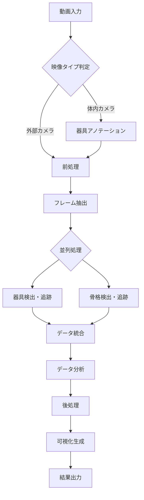

# AI手技モーションライブラリ AI処理フロー設計書

## 1. 処理フロー概要

### 1.1 全体アーキテクチャ



### 1.2 処理ステージ

| ステージ | 処理内容 | 使用技術 | 処理時間目安 |
|---------|---------|---------|-------------|
| 1. 前処理 | 動画読み込み、メタデータ抽出 | OpenCV | 5秒 |
| 2. フレーム抽出 | 5fps でフレーム抽出 | OpenCV | 10秒 |
| 3. 器具検出 | YOLOによる器具検出・追跡 | YOLOv8 | 2分 |
| 4. 骨格検出 | MediaPipeによる手の検出 | MediaPipe | 3分 |
| 5. データ統合 | 座標データの統合・変換 | NumPy | 30秒 |
| 6. 分析 | 速度・角度等の算出 | NumPy/Pandas | 1分 |
| 7. 可視化 | オーバーレイ動画生成 | OpenCV | 2分 |

## 2. 詳細処理フロー

### 2.1 Stage 1: 前処理

```python
class VideoPreprocessor:
    def process(self, video_path: str) -> VideoMetadata:
        """
        動画の前処理とメタデータ抽出
        """
        # 動画読み込み
        cap = cv2.VideoCapture(video_path)
        
        # メタデータ取得
        metadata = {
            'width': int(cap.get(cv2.CAP_PROP_FRAME_WIDTH)),
            'height': int(cap.get(cv2.CAP_PROP_FRAME_HEIGHT)),
            'fps': cap.get(cv2.CAP_PROP_FPS),
            'total_frames': int(cap.get(cv2.CAP_PROP_FRAME_COUNT)),
            'duration': cap.get(cv2.CAP_PROP_FRAME_COUNT) / cap.get(cv2.CAP_PROP_FPS)
        }
        
        # 品質チェック
        if metadata['width'] < 640 or metadata['height'] < 480:
            logging.warning("低解像度の動画です")
        
        return metadata
```

### 2.2 Stage 2: フレーム抽出

```python
class FrameExtractor:
    def extract(self, video_path: str, target_fps: int = 5) -> List[Frame]:
        """
        固定間隔でフレームを抽出
        """
        cap = cv2.VideoCapture(video_path)
        original_fps = cap.get(cv2.CAP_PROP_FPS)
        frame_interval = int(original_fps / target_fps)
        
        frames = []
        frame_count = 0
        
        while cap.isOpened():
            ret, frame = cap.read()
            if not ret:
                break
                
            if frame_count % frame_interval == 0:
                frames.append({
                    'frame_number': frame_count,
                    'timestamp': frame_count / original_fps,
                    'image': frame
                })
            
            frame_count += 1
        
        cap.release()
        return frames
```

### 2.3 Stage 3: 器具検出・追跡（体内カメラ用）

```python
class InstrumentDetector:
    def __init__(self, annotations: List[Annotation]):
        """
        Few-shot learningによる器具検出器の初期化
        """
        self.model = YOLO('yolov8n.pt')
        self.tracker = self._initialize_tracker(annotations)
        
    def _initialize_tracker(self, annotations):
        """
        アノテーションデータから追跡器を初期化
        """
        # テンプレート画像の抽出
        templates = []
        for ann in annotations:
            template = ann.image[ann.bbox.y:ann.bbox.y+ann.bbox.h,
                                ann.bbox.x:ann.bbox.x+ann.bbox.w]
            templates.append(template)
        
        return {
            'templates': templates,
            'last_position': None,
            'confidence_threshold': 0.8
        }
    
    def detect_and_track(self, frames: List[Frame]) -> List[Detection]:
        """
        YOLOとテンプレートマッチングを組み合わせた検出
        """
        detections = []
        
        for frame in frames:
            # YOLOによる物体検出
            results = self.model(frame['image'])
            
            # テンプレートマッチングで器具を特定
            best_match = self._template_matching(frame['image'])
            
            # 前フレームからの予測を考慮
            if self.tracker['last_position']:
                predicted_pos = self._predict_position()
                best_match = self._refine_detection(best_match, predicted_pos)
            
            # 検出失敗時の補間
            if best_match['confidence'] < self.tracker['confidence_threshold']:
                if self.tracker['last_position']:
                    best_match = self._interpolate_position()
            
            detections.append({
                'frame_number': frame['frame_number'],
                'timestamp': frame['timestamp'],
                'bbox': best_match['bbox'],
                'confidence': best_match['confidence']
            })
            
            self.tracker['last_position'] = best_match['bbox']
        
        return detections
    
    def _template_matching(self, image):
        """
        テンプレートマッチングによる器具検出
        """
        best_score = 0
        best_bbox = None
        
        for template in self.tracker['templates']:
            result = cv2.matchTemplate(image, template, cv2.TM_CCOEFF_NORMED)
            min_val, max_val, min_loc, max_loc = cv2.minMaxLoc(result)
            
            if max_val > best_score:
                best_score = max_val
                h, w = template.shape[:2]
                best_bbox = {
                    'x': max_loc[0],
                    'y': max_loc[1],
                    'w': w,
                    'h': h
                }
        
        return {'bbox': best_bbox, 'confidence': best_score}
```

### 2.4 Stage 4: 骨格検出（外部カメラ用）

```python
class HandSkeletonDetector:
    def __init__(self):
        """
        MediaPipe Handsの初期化
        """
        self.mp_hands = mp.solutions.hands
        self.hands = self.mp_hands.Hands(
            static_image_mode=False,
            max_num_hands=2,
            min_detection_confidence=0.8,
            min_tracking_confidence=0.8
        )
        
    def detect(self, frames: List[Frame]) -> List[SkeletonData]:
        """
        両手の骨格検出
        """
        skeleton_data = []
        
        for frame in frames:
            # RGB変換（MediaPipeはRGB画像を期待）
            rgb_frame = cv2.cvtColor(frame['image'], cv2.COLOR_BGR2RGB)
            results = self.hands.process(rgb_frame)
            
            frame_data = {
                'frame_number': frame['frame_number'],
                'timestamp': frame['timestamp'],
                'hands': []
            }
            
            if results.multi_hand_landmarks:
                for hand_idx, hand_landmarks in enumerate(results.multi_hand_landmarks):
                    # 左右の判定
                    handedness = results.multi_handedness[hand_idx].classification[0].label
                    
                    # 21個のランドマーク座標を正規化座標系で取得
                    landmarks = []
                    for landmark in hand_landmarks.landmark:
                        landmarks.append({
                            'x': landmark.x * 2 - 1,  # -1～1に正規化
                            'y': landmark.y * 2 - 1,  # -1～1に正規化
                            'z': landmark.z,
                            'visibility': landmark.visibility
                        })
                    
                    # 手首の角度計算
                    wrist_angle = self._calculate_wrist_angle(landmarks)
                    
                    frame_data['hands'].append({
                        'hand_type': handedness,
                        'landmarks': landmarks,
                        'wrist_angle': wrist_angle,
                        'confidence': results.multi_handedness[hand_idx].classification[0].score
                    })
            
            # 検出失敗時の補間
            if len(frame_data['hands']) == 0 and len(skeleton_data) > 0:
                frame_data = self._interpolate_skeleton(skeleton_data[-1], frame)
            
            skeleton_data.append(frame_data)
        
        return skeleton_data
    
    def _calculate_wrist_angle(self, landmarks):
        """
        手首の角度を計算
        """
        # MediaPipeの手のランドマーク定義に基づく
        # 0: 手首, 5: 人差し指の根本, 17: 小指の根本
        wrist = landmarks[0]
        index_base = landmarks[5]
        pinky_base = landmarks[17]
        
        # ベクトル計算
        v1 = np.array([index_base['x'] - wrist['x'], 
                      index_base['y'] - wrist['y']])
        v2 = np.array([pinky_base['x'] - wrist['x'], 
                      pinky_base['y'] - wrist['y']])
        
        # 角度計算
        angle = np.arccos(np.dot(v1, v2) / (np.linalg.norm(v1) * np.linalg.norm(v2)))
        return np.degrees(angle)
```

### 2.5 Stage 5: データ統合・分析

```python
class DataAnalyzer:
    def analyze(self, skeleton_data: List, instrument_data: List) -> AnalysisResult:
        """
        検出データの統合と分析
        """
        analysis_result = {
            'frames': [],
            'statistics': {}
        }
        
        previous_frame = None
        
        for i, frame in enumerate(skeleton_data):
            frame_analysis = {
                'frame_number': frame['frame_number'],
                'timestamp': frame['timestamp'],
                'metrics': {}
            }
            
            # 手の位置と速度計算
            for hand in frame.get('hands', []):
                hand_type = hand['hand_type']
                wrist_pos = hand['landmarks'][0]  # 手首の位置
                
                # 速度計算
                if previous_frame and hand_type in [h['hand_type'] for h in previous_frame.get('hands', [])]:
                    prev_wrist = self._get_previous_wrist(previous_frame, hand_type)
                    velocity = self._calculate_velocity(
                        prev_wrist, wrist_pos, 
                        frame['timestamp'] - previous_frame['timestamp']
                    )
                else:
                    velocity = 0
                
                frame_analysis['metrics'][f'{hand_type}_hand'] = {
                    'position': {'x': wrist_pos['x'], 'y': wrist_pos['y']},
                    'velocity': velocity,
                    'wrist_angle': hand['wrist_angle']
                }
            
            # 器具データの統合（体内カメラの場合）
            if instrument_data and i < len(instrument_data):
                inst = instrument_data[i]
                if inst['bbox']:
                    center_x = (inst['bbox']['x'] + inst['bbox']['w']/2) / frame['width']
                    center_y = (inst['bbox']['y'] + inst['bbox']['h']/2) / frame['height']
                    
                    frame_analysis['metrics']['instrument'] = {
                        'position': {
                            'x': center_x * 2 - 1,  # -1～1に正規化
                            'y': center_y * 2 - 1
                        },
                        'confidence': inst['confidence']
                    }
            
            analysis_result['frames'].append(frame_analysis)
            previous_frame = frame
        
        # 統計情報の計算
        analysis_result['statistics'] = self._calculate_statistics(analysis_result['frames'])
        
        # データの平滑化（移動平均フィルタ）
        analysis_result['frames'] = self._smooth_data(analysis_result['frames'])
        
        return analysis_result
    
    def _calculate_velocity(self, prev_pos, curr_pos, dt):
        """
        速度計算（ピクセル/秒）
        """
        if dt == 0:
            return 0
        dx = curr_pos['x'] - prev_pos['x']
        dy = curr_pos['y'] - prev_pos['y']
        distance = np.sqrt(dx**2 + dy**2)
        return distance / dt
    
    def _smooth_data(self, frames, window_size=3):
        """
        移動平均によるデータ平滑化
        """
        smoothed = []
        for i, frame in enumerate(frames):
            start_idx = max(0, i - window_size // 2)
            end_idx = min(len(frames), i + window_size // 2 + 1)
            window = frames[start_idx:end_idx]
            
            # 各メトリクスの平均を計算
            smoothed_frame = copy.deepcopy(frame)
            for metric_key in frame['metrics']:
                if 'position' in frame['metrics'][metric_key]:
                    x_values = [f['metrics'][metric_key]['position']['x'] 
                               for f in window if metric_key in f['metrics']]
                    y_values = [f['metrics'][metric_key]['position']['y'] 
                               for f in window if metric_key in f['metrics']]
                    if x_values and y_values:
                        smoothed_frame['metrics'][metric_key]['position']['x'] = np.mean(x_values)
                        smoothed_frame['metrics'][metric_key]['position']['y'] = np.mean(y_values)
            
            smoothed.append(smoothed_frame)
        
        return smoothed
    
    def _calculate_statistics(self, frames):
        """
        統計情報の計算
        """
        stats = {
            'total_frames': len(frames),
            'duration': frames[-1]['timestamp'] if frames else 0,
            'metrics': {}
        }
        
        # 各手の統計
        for hand_type in ['Left', 'Right']:
            key = f'{hand_type}_hand'
            velocities = [f['metrics'][key]['velocity'] 
                         for f in frames 
                         if key in f['metrics'] and 'velocity' in f['metrics'][key]]
            
            if velocities:
                stats['metrics'][key] = {
                    'avg_velocity': np.mean(velocities),
                    'max_velocity': np.max(velocities),
                    'min_velocity': np.min(velocities),
                    'std_velocity': np.std(velocities)
                }
        
        return stats
```

### 2.6 Stage 6: 可視化生成

```python
class VisualizationGenerator:
    def __init__(self):
        self.mp_drawing = mp.solutions.drawing_utils
        self.mp_hands = mp.solutions.hands
        
    def generate_overlay_video(self, original_video_path: str, 
                              analysis_result: dict, 
                              output_path: str):
        """
        解析結果をオーバーレイした動画を生成
        """
        cap = cv2.VideoCapture(original_video_path)
        
        # 出力動画の設定
        fourcc = cv2.VideoWriter_fourcc(*'mp4v')
        fps = cap.get(cv2.CAP_PROP_FPS)
        width = int(cap.get(cv2.CAP_PROP_FRAME_WIDTH))
        height = int(cap.get(cv2.CAP_PROP_FRAME_HEIGHT))
        out = cv2.VideoWriter(output_path, fourcc, fps, (width, height))
        
        frame_idx = 0
        analysis_idx = 0
        
        while cap.isOpened():
            ret, frame = cap.read()
            if not ret:
                break
            
            # 対応する解析データを取得
            if analysis_idx < len(analysis_result['frames']):
                current_analysis = analysis_result['frames'][analysis_idx]
                
                # フレーム番号が一致する場合のみオーバーレイ
                if frame_idx == current_analysis['frame_number']:
                    frame = self._draw_overlay(frame, current_analysis)
                    analysis_idx += 1
            
            out.write(frame)
            frame_idx += 1
        
        cap.release()
        out.release()
    
    def _draw_overlay(self, frame, analysis_data):
        """
        フレームにオーバーレイを描画
        """
        overlay = frame.copy()
        h, w = frame.shape[:2]
        
        # 手の骨格を描画
        for hand_key in ['Left_hand', 'Right_hand']:
            if hand_key in analysis_data['metrics']:
                hand_data = analysis_data['metrics'][hand_key]
                
                # 手の位置を描画（正規化座標から画像座標に変換）
                x = int((hand_data['position']['x'] + 1) * w / 2)
                y = int((hand_data['position']['y'] + 1) * h / 2)
                
                # 左右で色分け
                color = (0, 255, 0) if 'Left' in hand_key else (255, 0, 0)
                cv2.circle(overlay, (x, y), 10, color, -1)
                
                # 速度ベクトルを描画
                if 'velocity' in hand_data:
                    velocity = hand_data['velocity']
                    # ベクトルの長さを速度に比例させる
                    vector_length = int(velocity * 50)
                    cv2.arrowedLine(overlay, (x, y), 
                                  (x + vector_length, y), 
                                  color, 2)
                
                # 手首角度を表示
                if 'wrist_angle' in hand_data:
                    text = f"{hand_data['wrist_angle']:.1f}°"
                    cv2.putText(overlay, text, (x + 15, y - 15),
                              cv2.FONT_HERSHEY_SIMPLEX, 0.5, color, 1)
        
        # 器具のバウンディングボックスを描画
        if 'instrument' in analysis_data['metrics']:
            inst_data = analysis_data['metrics']['instrument']
            x = int((inst_data['position']['x'] + 1) * w / 2)
            y = int((inst_data['position']['y'] + 1) * h / 2)
            
            # 黄色でボックスを描画
            cv2.rectangle(overlay, (x - 25, y - 15), (x + 25, y + 15), 
                        (0, 255, 255), 2)
            
            # 信頼度を表示
            confidence_text = f"{inst_data['confidence']:.2f}"
            cv2.putText(overlay, confidence_text, (x - 20, y - 20),
                      cv2.FONT_HERSHEY_SIMPLEX, 0.5, (0, 255, 255), 1)
        
        # 半透明でオーバーレイ
        return cv2.addWeighted(frame, 0.7, overlay, 0.3, 0)
```

## 3. 性能最適化戦略

### 3.1 処理の並列化

```python
class ParallelProcessor:
    def __init__(self, use_gpu=False):
        self.use_gpu = use_gpu and torch.cuda.is_available()
        self.num_workers = 4 if not self.use_gpu else 2
        
    def process_video(self, video_path: str, video_type: str):
        """
        並列処理による高速化
        """
        with concurrent.futures.ThreadPoolExecutor(max_workers=self.num_workers) as executor:
            # フレーム抽出
            frames_future = executor.submit(self.extract_frames, video_path)
            
            frames = frames_future.result()
            
            # 骨格検出と器具検出を並列実行
            if video_type == 'external':
                skeleton_future = executor.submit(self.detect_skeleton, frames)
                skeleton_data = skeleton_future.result()
                instrument_data = None
            else:  # internal
                skeleton_future = executor.submit(self.detect_skeleton, frames)
                instrument_future = executor.submit(self.detect_instruments, frames)
                skeleton_data = skeleton_future.result()
                instrument_data = instrument_future.result()
            
            return skeleton_data, instrument_data
```

### 3.2 GPU利用時の最適化

```python
def setup_gpu_processing():
    """
    GPU利用可能時の設定
    """
    if torch.cuda.is_available():
        # YOLOのGPU設定
        device = 'cuda'
        torch.cuda.set_device(0)
        
        # バッチ処理サイズの調整
        batch_size = 16  # GPU利用時
    else:
        device = 'cpu'
        batch_size = 4   # CPU利用時
    
    return device, batch_size
```

### 3.3 メモリ管理

```python
class MemoryEfficientProcessor:
    def __init__(self, max_memory_gb=4):
        self.max_memory = max_memory_gb * 1024 * 1024 * 1024
        
    def process_large_video(self, video_path: str):
        """
        ストリーミング処理による大容量動画対応
        """
        cap = cv2.VideoCapture(video_path)
        
        # チャンクサイズの決定（5秒分のフレーム）
        fps = cap.get(cv2.CAP_PROP_FPS)
        chunk_size = int(fps * 5)
        
        results = []
        chunk_frames = []
        
        while cap.isOpened():
            ret, frame = cap.read()
            if not ret:
                # 最後のチャンクを処理
                if chunk_frames:
                    chunk_result = self.process_chunk(chunk_frames)
                    results.append(chunk_result)
                break
            
            chunk_frames.append(frame)
            
            if len(chunk_frames) >= chunk_size:
                # チャンクを処理
                chunk_result = self.process_chunk(chunk_frames)
                results.append(chunk_result)
                chunk_frames = []
        
        cap.release()
        return self.merge_results(results)
```

## 4. エラー処理とリカバリー

### 4.1 エラー処理フロー

```python
class ErrorHandler:
    def __init__(self):
        self.max_retries = 3
        self.interpolation_threshold = 0.2  # 20%まで欠損を許容
        
    def handle_detection_failure(self, frames_with_errors):
        """
        検出失敗時の処理
        """
        total_frames = len(frames_with_errors)
        error_frames = sum(1 for f in frames_with_errors if f.get('error'))
        error_rate = error_frames / total_frames
        
        if error_rate > self.interpolation_threshold:
            # エラー率が閾値を超える場合
            return self.fallback_processing(frames_with_errors)
        else:
            # 補間処理
            return self.interpolate_missing_data(frames_with_errors)
    
    def interpolate_missing_data(self, frames):
        """
        欠損データの補間
        """
        interpolated = []
        
        for i, frame in enumerate(frames):
            if frame.get('error'):
                # 前後のフレームから線形補間
                prev_frame = self.find_valid_frame(frames, i, -1)
                next_frame = self.find_valid_frame(frames, i, 1)
                
                if prev_frame and next_frame:
                    interpolated_frame = self.linear_interpolation(
                        prev_frame, next_frame, 
                        (i - frames.index(prev_frame)) / 
                        (frames.index(next_frame) - frames.index(prev_frame))
                    )
                    interpolated.append(interpolated_frame)
                else:
                    # 補間不可能な場合はスキップ
                    continue
            else:
                interpolated.append(frame)
        
        return interpolated
```

## 5. 精度評価指標

### 5.1 評価メトリクス

| 指標 | 目標値 | 測定方法 |
|------|--------|----------|
| 器具検出精度 | > 80% | 信頼度スコアの平均 |
| 骨格検出精度 | > 80% | MediaPipe信頼度 |
| 欠損フレーム率 | < 20% | 検出失敗フレーム/総フレーム |
| 軌跡の滑らかさ | - | ジャーク（加加速度）の標準偏差 |
| 処理時間 | < 動画時間 | 実処理時間/動画時間 |

### 5.2 精度向上の優先順位

1. **検出精度** - 最重要：正確なデータ取得
2. **軌跡の滑らかさ** - 重要：自然な動きの再現
3. **処理速度** - 中程度：ユーザビリティ
4. **欠損の少なさ** - 低：補間で対応可能

## 6. 出力データ仕様

### 6.1 JSON形式の解析結果

```json
{
  "metadata": {
    "video_id": "uuid",
    "video_type": "external",
    "duration": 300.5,
    "fps_analyzed": 5,
    "processing_time": 285.3
  },
  "frames": [
    {
      "frame_number": 0,
      "timestamp": 0.0,
      "hands": {
        "left": {
          "position": {"x": -0.3, "y": 0.2},
          "velocity": 0.0,
          "wrist_angle": 45.2,
          "confidence": 0.95
        },
        "right": {
          "position": {"x": 0.3, "y": 0.2},
          "velocity": 0.0,
          "wrist_angle": 42.1,
          "confidence": 0.93
        }
      },
      "instrument": {
        "position": {"x": 0.0, "y": 0.1},
        "bbox": {"x": 100, "y": 200, "w": 50, "h": 30},
        "confidence": 0.87
      }
    }
  ],
  "statistics": {
    "hands": {
      "left": {
        "avg_velocity": 15.3,
        "max_velocity": 45.2,
        "total_distance": 1523.4
      },
      "right": {
        "avg_velocity": 14.8,
        "max_velocity": 42.1,
        "total_distance": 1487.2
      }
    },
    "quality_metrics": {
      "detection_rate": 0.92,
      "interpolation_rate": 0.08,
      "avg_confidence": 0.89
    }
  }
}
```

## 7. 今後の拡張計画

### 7.1 Phase 2 機能追加

- **手術フェーズ自動認識**: セグメンテーションモデルの導入
- **危険動作検出**: 異常パターンの学習
- **3D reconstruction**: ステレオカメラ対応

### 7.2 モデル改善計画

- ユーザーフィードバックの収集システム
- オンライン学習による精度向上
- カスタムモデルのトレーニング環境構築