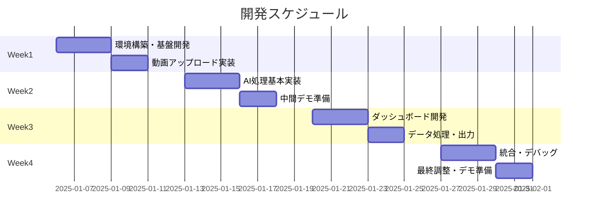

# AI手技モーション伝承ライブラリ 開発WBS

## 1. プロジェクト概要

### 1.1 基本情報
- **開発期間**: 2025年1月第2週 〜 2025年2月第2週（4週間）
- **総作業時間**: 80時間（20時間/週 × 4週）
- **開発体制**: 1名（全工程担当）
- **中間デモ**: 2週間後
- **最終デモ**: 4週間後

### 1.2 制約事項
- パートタイム開発（週20時間）
- 他業務との並行作業
- 外部サポートなし
- AI/機械学習実装が技術的課題

## 2. フェーズ別スケジュール



## 3. WBS詳細

### Week 1: 基盤構築フェーズ（20時間）

#### 1.1 開発環境構築（6時間）
| タスク | 時間 | 成果物 |
|--------|------|---------|
| プロジェクト初期設定 | 1h | GitHubリポジトリ |
| Pythonバックエンド環境構築 | 2h | FastAPI基本構造 |
| Reactフロントエンド環境構築 | 2h | Next.js基本構造 |
| DB環境構築（SQLite） | 1h | 基本テーブル作成 |

#### 1.2 動画アップロード機能（14時間）
| タスク | 時間 | 成果物 |
|--------|------|---------|
| アップロードAPI実装 | 4h | POST /api/videos/upload |
| フロントエンド画面作成 | 4h | アップロード画面 |
| ファイル保存処理 | 2h | ローカルストレージ保存 |
| DB登録処理 | 2h | 動画メタデータ保存 |
| 基本動作テスト | 2h | アップロード確認 |

**Week 1 成果物**: 動画をアップロードして保存できる最小システム

### Week 2: AI処理実装フェーズ（20時間）

#### 2.1 MediaPipe骨格検出（8時間）
| タスク | 時間 | 成果物 |
|--------|------|---------|
| MediaPipeセットアップ | 2h | 動作確認 |
| 手の検出処理実装 | 3h | 基本検出機能 |
| データ抽出処理 | 2h | 座標データ取得 |
| 簡易テスト | 1h | サンプル動画で検証 |

#### 2.2 YOLO器具検出（8時間）
| タスク | 時間 | 成果物 |
|--------|------|---------|
| YOLOセットアップ | 2h | 動作確認 |
| アノテーション機能 | 3h | 簡易UI実装 |
| 器具追跡処理 | 2h | 基本追跡機能 |
| 簡易テスト | 1h | サンプル動画で検証 |

#### 2.3 中間デモ準備（4時間）
| タスク | 時間 | 成果物 |
|--------|------|---------|
| 処理フロー統合 | 2h | エンドツーエンド動作 |
| デモ用データ準備 | 1h | サンプル動画・結果 |
| 動作確認・修正 | 1h | デモ環境 |

**Week 2 成果物**: AI処理が動作する中間デモ（精度は低くてもOK）

### Week 3: UI/データ処理フェーズ（20時間）

#### 3.1 ダッシュボード開発（12時間）
| タスク | 時間 | 成果物 |
|--------|------|---------|
| 動画プレーヤー実装 | 3h | オーバーレイ表示 |
| グラフ表示（Chart.js） | 4h | 軌跡・速度グラフ |
| データテーブル表示 | 2h | 座標データ表示 |
| レイアウト調整 | 3h | 基本UI完成 |

#### 3.2 データ処理・出力（8時間）
| タスク | 時間 | 成果物 |
|--------|------|---------|
| データ分析処理 | 3h | 速度・角度計算 |
| JSON生成処理 | 2h | 構造化データ |
| CSV/Excelエクスポート | 2h | ダウンロード機能 |
| 基本テスト | 1h | 出力確認 |

**Week 3 成果物**: グラフ表示とデータ出力が可能なダッシュボード

### Week 4: 統合・完成フェーズ（20時間）

#### 4.1 システム統合（10時間）
| タスク | 時間 | 成果物 |
|--------|------|---------|
| API統合テスト | 3h | 全機能結合 |
| エラー処理追加 | 2h | 基本エラーハンドリング |
| 処理フロー最適化 | 3h | パフォーマンス改善 |
| バグ修正 | 2h | 既知の問題解決 |

#### 4.2 ライブラリ機能（簡易版）（6時間）
| タスク | 時間 | 成果物 |
|--------|------|---------|
| 保存機能実装 | 2h | 結果保存API |
| 一覧表示画面 | 2h | 簡易リスト表示 |
| 基本動作確認 | 2h | CRUD操作 |

#### 4.3 最終準備（4時間）
| タスク | 時間 | 成果物 |
|--------|------|---------|
| 最終動作確認 | 1h | 全機能チェック |
| README作成 | 1h | セットアップ手順 |
| デモシナリオ作成 | 1h | プレゼン資料 |
| デプロイ（ローカル） | 1h | デモ環境構築 |

**Week 4 成果物**: MVP完成版

## 4. リスク管理計画

### 4.1 技術リスクと対策

| リスク | 影響度 | 発生確率 | 対策 |
|--------|--------|----------|------|
| AI処理の精度不足 | 高 | 中 | 「精度は後で改善」と事前説明 |
| 処理時間が長い | 中 | 高 | 短い動画でデモ実施 |
| MediaPipe/YOLO習得遅れ | 高 | 中 | 事前に公式チュートリアル確認 |
| 統合時のバグ | 中 | 高 | 早めの統合テスト |

### 4.2 スケジュールリスクと対策

| リスク | 対策 |
|--------|------|
| 他業務の割り込み | バッファ時間を各週2時間確保 |
| 実装の遅れ | 優先度の低い機能を削除 |
| デモ準備不足 | 最低限動くものを優先 |

## 5. 成果物と完了基準

### 5.1 中間デモ（2週間後）の完了基準

- ✅ 動画をアップロードできる
- ✅ AI処理が実行される（精度不問）
- ✅ 処理結果が何らかの形で表示される

### 5.2 MVP（4週間後）の完了基準

- ✅ 5分以内の動画を処理できる
- ✅ 手または器具の追跡が可能
- ✅ グラフで結果が表示される
- ✅ データをCSVでダウンロードできる
- ✅ エラーなく一連の処理が完了する

## 6. 削減可能な機能（時間不足時）

優先度順（低いものから削除）：
1. ライブラリ機能の検索・フィルター
2. 3D軌跡表示
3. 動画のオーバーレイ表示
4. 複数グラフの同時表示
5. UI/UXの細かい調整

## 7. 効率化のための開発方針

### 7.1 コーディング方針
- **動くことを最優先**（リファクタリングは後）
- **既存ライブラリを最大限活用**
- **エラー処理は最小限**
- **テストは手動確認のみ**

### 7.2 実装の簡略化
- 認証機能なし
- 複雑なUIは避ける
- キャッシュ処理なし
- 並列処理は必要最小限

### 7.3 外部リソースの活用
- ChatGPT/Claudeでコード生成
- 公式ドキュメントのサンプルコード利用
- オープンソースのUIコンポーネント使用

## 8. 日次タスク管理

### GitHub Projectsの活用
```
カンバンボード：
- Backlog（タスク一覧）
- In Progress（作業中：最大2つ）
- Review（確認待ち）
- Done（完了）
```

### 日次進捗の記録例
```markdown
## 2025/01/06 (月) - 3時間
- [x] GitHubリポジトリ作成
- [x] FastAPI初期設定
- [ ] Next.js設定（明日継続）

課題：
- FastAPIのCORS設定で時間を取られた

明日：
- Next.js環境構築完了
- DB設定開始
```

## 9. コミュニケーション計画

### 9.1 定期報告
- **週次**: 金曜日に進捗サマリー
- **中間デモ**: 2週間後に動作デモ
- **最終デモ**: 4週間後に全機能デモ

### 9.2 課題エスカレーション
- 技術的な壁にぶつかったら即座に代替案検討
- スケジュール遅延が見込まれたら機能削減を検討

## 10. MVP後の展開（参考）

### Phase 1.5（MVP改善）- 2週間
- UI/UXのブラッシュアップ
- 処理速度の最適化
- バグ修正

### Phase 2（機能追加）- 1ヶ月
- 採点モード実装
- AIフィードバック機能
- ユーザー認証
- クラウドデプロイ

---

## チェックリスト

### 開発開始前
- [ ] GitHubリポジトリ作成
- [ ] 開発環境の動作確認
- [ ] サンプル動画の準備（1分程度）
- [ ] MediaPipe/YOLOのチュートリアル確認

### 週次チェック
- [ ] GitHub Projectsの更新
- [ ] 作業時間の記録
- [ ] 次週のタスク優先順位決定
- [ ] リスクの再評価

### デモ前チェック
- [ ] デモ環境の動作確認
- [ ] サンプルデータの準備
- [ ] 既知の問題リスト作成
- [ ] プレゼン資料の確認