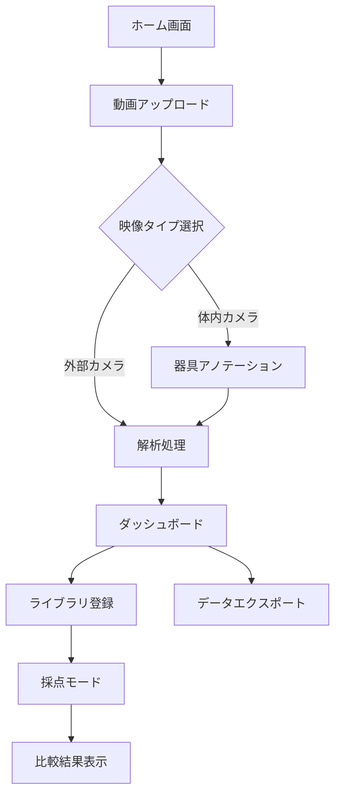

# AI手技モーション伝承ライブラリ UI/UX設計書

## 1. デザインコンセプト

### 1.1 ビジョン
医療従事者が直感的に操作でき、手術手技の解析から学習まで一連の流れをスムーズに行えるプロフェッショナルなWebアプリケーション

### 1.2 デザイン原則
- **清潔感**: 医療系らしい白・青系のカラーテーマ
- **視認性**: 重要な情報が一目で分かる
- **効率性**: 最小限の操作で目的を達成
- **信頼性**: エラーが少なく、処理状況が明確

### 1.3 カラーパレット
```
Primary Blue:    #0066CC (メインアクション)
Secondary Blue:  #4A90E2 (サブアクション)
Background:      #FFFFFF (メイン背景)
Light Gray:      #F5F7FA (セクション背景)
Dark Gray:       #333333 (テキスト)
Success Green:   #28A745 (成功・完了)
Warning Orange:  #FFC107 (警告・注意)
Error Red:       #DC3545 (エラー)
```

## 2. 画面フロー



## 3. 画面設計詳細

### 3.1 ホーム画面

#### レイアウト
```
┌─────────────────────────────────────────┐
│  [Logo] AI手技モーション伝承ライブラリ    │
├─────────────────────────────────────────┤
│                                         │
│    ┌──────────┐  ┌──────────┐        │
│    │          │  │          │        │
│    │  新規    │  │ ライブラリ│        │
│    │  解析    │  │          │        │
│    └──────────┘  └──────────┘        │
│                                         │
│    ┌──────────┐  ┌──────────┐        │
│    │          │  │          │        │
│    │  採点    │  │  履歴    │        │
│    │  モード  │  │          │        │
│    └──────────┘  └──────────┘        │
│                                         │
└─────────────────────────────────────────┘
```

#### 要素説明
- 大きなカード型ボタン（アイコン付き）で主要機能へアクセス
- 各カードにホバーエフェクトで説明テキスト表示

### 3.2 動画アップロード画面

#### レイアウト
```
┌─────────────────────────────────────────┐
│  [←戻る] 動画アップロード                │
├─────────────────────────────────────────┤
│                                         │
│  ┌───────────────────────────────┐    │
│  │                                 │    │
│  │    ドラッグ&ドロップ            │    │
│  │    またはクリックして選択        │    │
│  │    [📁 ファイルを選択]          │    │
│  │                                 │    │
│  └───────────────────────────────┘    │
│                                         │
│  任意項目:                              │
│  手術名: [_______________]              │
│  日付:   [_______________]              │
│  執刀医: [_______________]              │
│  メモ:   [_______________]              │
│                                         │
│         [次へ: 映像タイプ選択]          │
└─────────────────────────────────────────┘
```

### 3.3 映像タイプ選択画面

#### レイアウト
```
┌─────────────────────────────────────────┐
│  映像タイプを選択してください            │
├─────────────────────────────────────────┤
│                                         │
│   ┌─────────────┐  ┌─────────────┐  │
│   │     🔬      │  │     👥      │  │
│   │             │  │             │  │
│   │ 体内カメラ   │  │ 外部カメラ   │  │
│   │             │  │             │  │
│   │ 腹腔鏡など   │  │ 手元撮影     │  │
│   └─────────────┘  └─────────────┘  │
│                                         │
└─────────────────────────────────────────┘
```

### 3.4 器具アノテーション画面（体内カメラ選択時）

#### レイアウト
```
┌─────────────────────────────────────────┐
│  手術器具を指定してください (1/5)        │
├─────────────────────────────────────────┤
│  ┌─────────────────────────────────┐  │
│  │                                   │  │
│  │         [動画フレーム表示]         │  │
│  │                                   │  │
│  │   ※マウスで器具を囲んでください    │  │
│  │                                   │  │
│  └─────────────────────────────────┘  │
│                                         │
│  [前の画像] [次の画像] [やり直し]       │
│                                         │
│  進捗: ●●●○○                          │
│                                         │
│           [解析を開始]                  │
└─────────────────────────────────────────┘
```

### 3.5 解析処理画面

#### レイアウト
```
┌─────────────────────────────────────────┐
│  解析処理中...                          │
├─────────────────────────────────────────┤
│                                         │
│  処理ステータス:                        │
│  ✓ 動画読み込み完了                     │
│  ⚡ 骨格検出処理中... (45%)             │
│  ○ 器具追跡処理                        │
│  ○ データ生成                          │
│                                         │
│  ▓▓▓▓▓▓▓▓░░░░░░░░░░ 45%              │
│                                         │
│  推定残り時間: 約5分                    │
│                                         │
│  [キャンセル]  [バックグラウンドで実行]  │
│                                         │
└─────────────────────────────────────────┘
```

### 3.6 ダッシュボード（結果表示）画面

#### レイアウト
```
┌─────────────────────────────────────────────────────────┐
│  解析結果 - [手術名/日付]        [📥 エクスポート]      │
├─────────────────────────────────────────────────────────┤
│                                                         │
│  ┌─────────────────────────────────┐                 │
│  │                                   │                 │
│  │     解析済み動画プレーヤー         │                 │
│  │     (オーバーレイ表示付き)        │                 │
│  │                                   │                 │
│  │  [▶] ━━━━━●━━━━━━ 03:45/10:00   │                 │
│  │  [0.5x][1x][2x] [<<][>>]         │                 │
│  └─────────────────────────────────┘                 │
│                                                         │
│  ┌─────────────────┐ ┌─────────────────┐            │
│  │  軌跡グラフ      │ │  速度変化       │            │
│  │                 │ │                 │            │
│  └─────────────────┘ └─────────────────┘            │
│                                                         │
│  ┌─────────────────┐ ┌─────────────────┐            │
│  │  3D軌跡表示     │ │  統計サマリー    │            │
│  │                 │ │  平均速度: XXmm/s │            │
│  └─────────────────┘ └─────────────────┘            │
│                                                         │
│  データテーブル                                        │
│  ┌──────┬──────┬──────┬──────┬────────┐            │
│  │ 時間  │  X   │  Y   │ 速度  │ 骨格角度│            │
│  ├──────┼──────┼──────┼──────┼────────┤            │
│  │ 0:01 │ 123  │ 456  │ 12.3 │  45°   │            │
│  └──────┴──────┴──────┴──────┴────────┘            │
│                                                         │
│  [ライブラリに登録]                                    │
└─────────────────────────────────────────────────────────┘
```

### 3.7 ライブラリ画面

#### レイアウト
```
┌─────────────────────────────────────────┐
│  手技ライブラリ                         │
├─────────────────────────────────────────┤
│  検索: [___________] [🔍]               │
│  フィルター: [手術名▼] [日付▼]         │
│                                         │
│  ┌─────────────────────────────────┐  │
│  │ ▶ 腹腔鏡手術_20250104           │  │
│  │   執刀医: 山田医師                │  │
│  │   登録日: 2025/01/04             │  │
│  ├─────────────────────────────────┤  │
│  │ ▶ 内視鏡手術_20250102           │  │
│  │   執刀医: 佐藤医師                │  │
│  │   登録日: 2025/01/02             │  │
│  └─────────────────────────────────┘  │
│                                         │
│  [採点モードで使用]                     │
└─────────────────────────────────────────┘
```

### 3.8 採点モード画面

#### レイアウト
```
┌─────────────────────────────────────────┐
│  採点モード                             │
├─────────────────────────────────────────┤
│                                         │
│  比較元モデル選択:                      │
│  [ライブラリから選択 ▼]                │
│                                         │
│  評価する動画:                          │
│  [📁 ファイルを選択]                   │
│                                         │
│  [比較開始]                             │
└─────────────────────────────────────────┘
```

### 3.9 比較結果表示画面

#### レイアウト
```
┌─────────────────────────────────────────────────┐
│  比較結果                                       │
├─────────────────────────────────────────────────┤
│                                                 │
│  スコア: 85/100                                │
│                                                 │
│  ┌──────────────┐  ┌──────────────┐         │
│  │  指導医       │  │  学習者       │         │
│  │  (モデル)     │  │              │         │
│  └──────────────┘  └──────────────┘         │
│                                                 │
│  比較グラフ:                                    │
│  ┌────────────────────────────────┐          │
│  │  [軌跡の重ね合わせ表示]         │          │
│  └────────────────────────────────┘          │
│                                                 │
│  AIフィードバック:                             │
│  ┌────────────────────────────────┐          │
│  │ • 切開時の速度を20%向上させましょう        │
│  │ • 器具の角度が理想より15度離れています      │
│  │ • 全体的な動きの滑らかさは良好です         │
│  └────────────────────────────────┘          │
│                                                 │
└─────────────────────────────────────────────────┘
```

## 4. インタラクション設計

### 4.1 アニメーション
- **ページ遷移**: フェードイン/アウト (300ms)
- **ボタンホバー**: 色変化 + わずかな拡大 (scale: 1.02)
- **ローディング**: パルスアニメーション
- **グラフ描画**: 左から右へのアニメーション描画

### 4.2 フィードバック
- **成功時**: 緑色のトースト通知（画面右上）
- **エラー時**: 赤色のアラート + 詳細メッセージ
- **処理中**: プログレスバー + ステータステキスト

### 4.3 ショートカット
- `Space`: 動画の再生/一時停止
- `←/→`: フレーム送り
- `Ctrl+E`: エクスポート
- `Esc`: モーダル/ダイアログを閉じる

## 5. レスポンシブ対応（将来）

### ブレークポイント
- Desktop: 1280px以上
- Tablet: 768px - 1279px（将来対応）
- Mobile: 767px以下（将来対応）

## 6. アクセシビリティ

### 基本方針
- **コントラスト比**: WCAG AAレベル準拠（4.5:1以上）
- **フォントサイズ**: 最小14px
- **クリック領域**: 最小44×44px
- **キーボード操作**: 全機能をキーボードで操作可能

## 7. エラー処理

### エラーメッセージ例
| エラー種類 | メッセージ |
|-----------|----------|
| ファイル形式 | "MP4形式のファイルを選択してください" |
| ファイルサイズ | "ファイルサイズが大きすぎます（最大2GB）" |
| 解析失敗 | "解析に失敗しました。動画を確認してください" |
| ネットワーク | "接続エラーが発生しました。再試行してください" |

## 8. パフォーマンス指標

### 目標値
- **初回読み込み**: 3秒以内
- **ページ遷移**: 500ms以内
- **ボタンレスポンス**: 100ms以内
- **データ表示**: 1秒以内

## 9. 今後の拡張予定

### Phase 2
- ダークモード対応
- 多言語対応（英語）
- タブレット最適化
- リアルタイムコラボレーション機能

### Phase 3
- モバイルアプリ開発
- 音声ガイド機能
- VR/AR表示対応